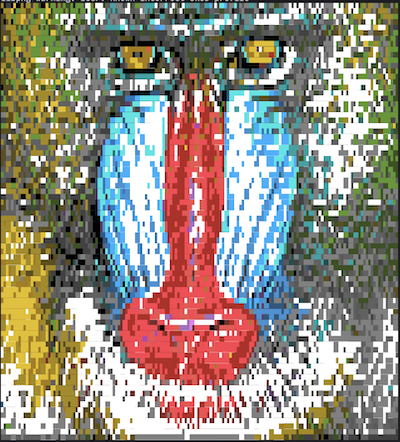

img2ansi
========

## Block-Based ANSI Art Dithering Algorithm (Brown Dithering Algorithm)

This project implements a unique dithering algorithm specifically designed
for converting images into ANSI art. Unlike traditional dithering methods,
my approach uses a block-based processing technique optimized for terminal
and text-based display.

## Key Features

1. **Block-Based Processing**: Operates on 2x2 pixel blocks instead of
   individual pixels, allowing for more complex patterns within a single
   character cell.

2. **ANSI Color Quantization**: Utilizes a specialized color quantization
   scheme tailored for the ANSI color palette, ensuring optimal color
   representation in terminal environments.

3. **Unicode Block Character Selection**: Chooses the best Unicode block
   character to represent each 2x2 pixel block, maximizing the detail in the
   final ANSI art.

4. **Dual-Color Representation**: Each block is represented by both a
   foreground and background color, enabling more nuanced color transitions
   and detail.

5. **Edge Detection Integration**: Incorporates edge detection to adjust
   error distribution, preserving important image details.

6. **Optimized for Text Output**: Designed to produce ANSI escape code
   sequences, making it ideal for terminal-based image display.

7. **Optimized KD Tree Search**: Optimized for ANSI art generation by
   precomputing quantized color distances.

## How It Works

The algorithm processes the input image in 2x2 blocks, determining the best
Unicode character and color combination to represent each block. It then
uses a modified error diffusion technique inspired by Floyd-Steinberg
dithering to distribute quantization errors to neighboring blocks.

This approach results in high-quality ANSI art that preserves the detail
and color of the original image while optimizing for the constraints of
text-based display.

## Requirements
Requires OpenCV 4 to be installed.

## Example Output

The below examples are 80 column wide images, with a scale factor of 2. The
first example uses the default 16-color ANSI palette, while the second example
uses the 256 color scheme.





## Installation
To build the program, run the following commands:

```sh
go build github.com/wbrown/ansi2img/cmd/ansify
```

## Usage
`./img2ansi -input <input> [-output <output>] [-width <width>]
[-scale <scale>] [-quantization <quantization>] [-maxchars <maxchars>]
[-color_method <color_method>] [-palette <palette>] [-kdsearch <kdsearch>]
[-cache_threshold <cache_threshold>]`

**Performance**

The following performance options are available. There are tradeoffs between
speed and quality. The defaults are chosen to be a good balance between the
two. But if you want the absolute best quality, set the `-kdsearch` option to
`0` and the `-cache_threshold` option to `0`. This may cause the program to
take multiple minutes to run.

* `-kdsearch <int>`: Number of nearest neighbors to search in KD-tree, `0` to
  disable (default `50`)

The KD search option is the number of nearest neighbors to search in the
KD-tree for the block cache. A value of `0` will disable the KD-tree search
and the cache.

* `-cache_threshold <float>`: Threshold for block cache (default `40`)

The block cache is a cache of the block characters that are used to render the
image. The cache is used to speed up the program by not having to recompute
the blocks for each 2x2 pixel block in the image. It is a fuzzy cache, so it
is thresholded on error distance from the target block.

There are built in embedded palettes that have precomputed tables for the
colors. These are `ansi16`, `ansi256`, and `jetbrains32`. Each precomputed
palette also has three color spaces that are precomputed: `RGB`, `Lab`, and
`Redmean`. The default is `Redmean`.

**Colors**

By default the program uses the 16-color ANSI palette, split into 8 foreground
colors and 8 background colors. There are three palettes built in, selectable
by using the `-palette` option:
* `ansi16`: The default 16-color ANSI palette
* `ansi256`: The 256-color ANSI palette
* `jetbrains32`: The JetBrains color scheme that uses 32 colors by having
    separate palettes for foreground and background colors.
The program performs well without quantization, but if you want to reduce the
number of colors in the output, you can use the `-quantization` option. The
default is `256` colors. This isn't the output colors, but the number of
colors used in the quantization step.

There are three color space options available: `RGB`, `Lab`, and `Redmean`. 
The most perceptually accurate is `Lab`, but it is also the slowest. The
default is `Redmean`.

**Image Size**

The `-width` option can be used to set the target width of the output image,
this is the primary factor in determining the output ANSI dimensions. The
default `-scale` is `2`, which approximately halves the height of the output,
to compensate for the fact that characters are taller than they are wide.

```
  -cache_threshold float
    	Threshold for block cache (default 40)
  -colormethod string
    	Color distance method: RGB, LAB, or Redmean (default "RGB")
  -input string
    	Path to the input image file (required)
  -kdsearch int
    	Number of nearest neighbors to search in KD-tree, 0 to disable (default 50)
  -maxchars int
    	Maximum number of characters in the output (default 1048576)
  -output string
    	Path to save the output (if not specified, prints to stdout)
  -palette string
    	Path to the palette file (Embedded: ansi16, ansi256, jetbrains32) (default "ansi16")
  -quantization int
    	Quantization factor (default 256)
  -scale float
    	Scale factor for the output image (default 2)
  -width int
    	Target width of the output image (default 80)
```
