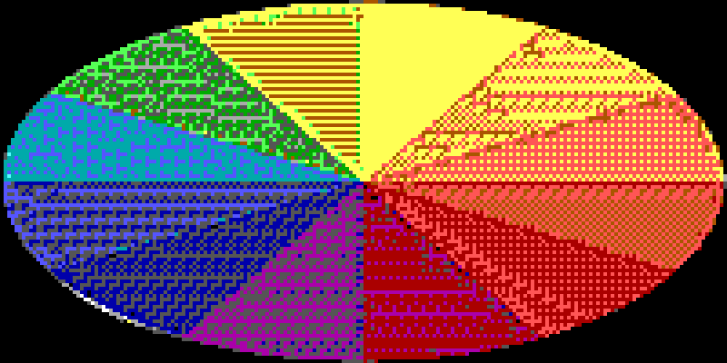
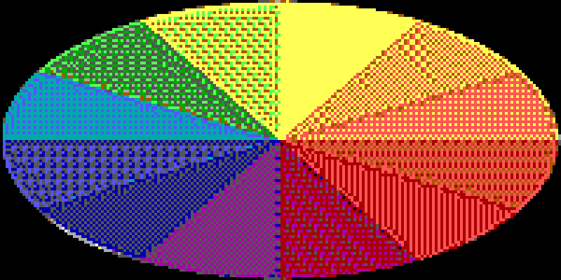
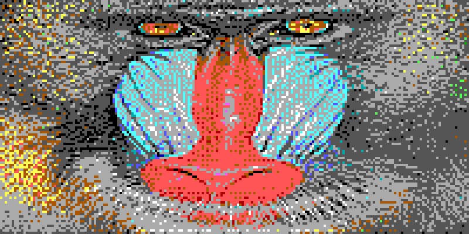

# Error Diffusion Quadrant Fix — Visual Comparisons

Error diffusion previously selected each pixel's residual target (fg vs
bg) by testing bits of the rune *codepoint*, which disagrees with the
actual quadrant table for 25 of 64 pixels across the 16 block
characters. Residuals were therefore measured against colors the pixels
do not render as, and diffusion partially fought the block search. The
fix measures residuals against the rune's real quadrant pattern.

All renders below are produced by `diffusion_quality_test.go`
(`DIFFUSION_PNGS=<dir> go test -run TestDiffusionQuality`), shown at 4×
nearest-neighbor of native block resolution, ansi16 palette.

The wrong residuals showed up as gray contamination and directional worm
artifacts in flat saturated regions — most visible on the color wheel
and the fox's fur/snow; after the fix those regions settle into clean
two-color dither patterns.

| image | reference | before fix | after fix |
|---|---|---|---|
| gray gradient |  |  |  |
| color wheel |  |  |  |
| fox |  |  |  |
| mandrill |  |  |  |

## Metrics

Blurred-LAB ΔE (σ=1) of the diffusion arm against the pre-dither
reference — lower is better. See `diffusion_quality_test.go` for the
metric rationale (raw MSE rewards banding; diffusion's job is local
average tone, which the blur exposes).

| image | before | after | change |
|---|---|---|---|
| gray-gradient | 3.23 | 2.74 | −15% |
| fleshtone | 15.43 | 14.37 | −7% |
| color-ramp | 12.72 | 11.39 | −10% |
| fox | 11.03 | 10.02 | −9% |
| mandrill | 13.17 | 12.88 | −2% |
| wheel | 12.44 | 10.26 | −18% |

Attribute transitions also drop on every image (e.g. fleshtone 646 →
507): equal-or-better tone with less escape-code churn. Mandrill is
statistically flat on the blurred metric (dense texture masks residual
error) but improves 11% on raw MSE.
